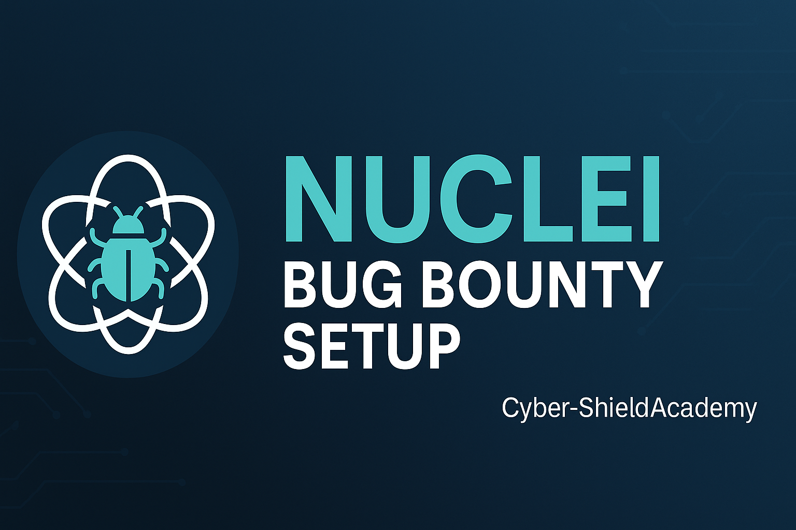

# Nuclei Bug Bounty Setup 🎯

[](https://Cyber-ShieldAcademy.github.io/Nuclei-BugBounty-Setup/)

<p align="center">
  
</p>

<p align="center">
  <a href="https://github.com/Cyber-ShieldAcademy/Nuclei-BugBounty-Setup/stargazers"></a>
  <a href="https://github.com/Cyber-ShieldAcademy/Nuclei-BugBounty-Setup/network/members"></a>
  <a href="https://github.com/Cyber-ShieldAcademy/Nuclei-BugBounty-Setup/blob/main/LICENSE"></a>
  <a href="https://github.com/Cyber-ShieldAcademy/Nuclei-BugBounty-Setup/actions"></a>
</p>

---
---


📊 **Last Scan Summary**

- 🔍 Target: https://example.com
- 📅 Date: 2025-07-02
- 📁 Report: [View results/2025-07-02_07-38_cves.txt](results/2025-07-02_07-38_cves.txt)

## 🚀 Features

- ✅ Daily Nuclei template updates (via GitHub Actions)
- 🧠 Custom scripts for scanning, logging, and auto-categorizing
- 🖥️ Easy CLI installer with `setup/install.sh`
- 🧩 Ready-to-go template structure
- 🧪 Ideal for bug bounty hunters and red teamers

---

## 🛠 Setup

### 1. Clone the repo:
```bash
git clone https://github.com/Cyber-ShieldAcademy/Nuclei-BugBounty-Setup.git
cd Nuclei-BugBounty-Setup

## 🚫 Ignored Templates

To reduce noise and irrelevant results, we exclude some templates using `nuclei-ignore.yaml`.

Example:

```yaml
id:
  - cves/2020/CVE-2020-0000
tags:
  - headless
  - fuzz
